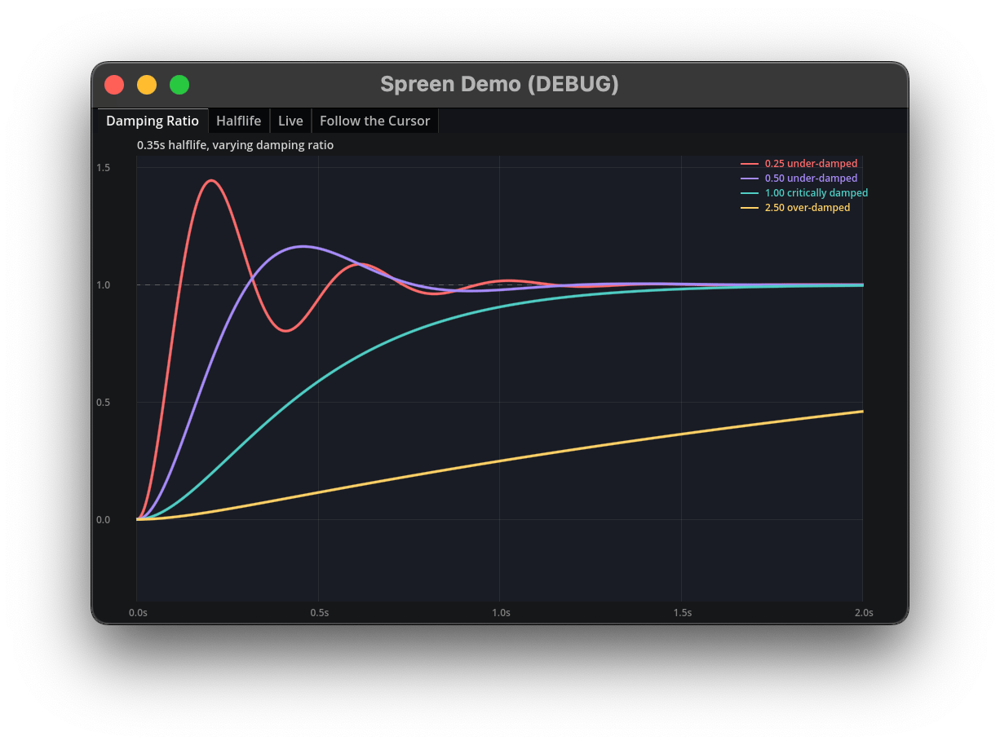

# Spreen



Spreen provides a Tween-like API for animation and interpolation using springs as a base. Unlike `TRANS_SPRING` in the Tween library, these springs are defined by damping ratios and halflife.

These help you make fantastic character and camera controllers, reacting to user input in very natural ways.

Spreen builds either as an engine module or as a GDExtension. See [Building](#building).

## The Basics

1. Install the GDEXtension, build Spreen as a module, or build as a custom GDExtension. See [Building](#building) below.

2. Create a Spreen object, optionally binding it to a node (in this case, `self`).

```gdscript
var spreen := SpreenTree.create_spreen(self)
```

3. Optionally set whether the Spreen can finish, typically you will not want to finish a controller spreen.

```gdscript
spreen.set_finishable(false)
```

4. Create and optionally save reference to a property tweener.

```gdscript
var transform_spreen := spreen.spreen_transform_3d(%Box, "global_transform", %Box.global_transform.looking_at(%Target.global_position), 0.5, 0.25)
```

5. Update the springs goal in real time.

```gdscript
transform_spreen.update_goal(%Box.global_transform.looking_at(%Target.global_position))
```

## Building

Spreen can be built as a Godot module (targeting 4.7+) or GDExtension (targeting 4.3+).

### As an engine module

Include this repository in your `custom_modules`, then build Godot as usual.

### As a GDExtension

The official Spreen GDExtension is built using:

```sh
scons target=template_debug api_version=4.3
scons target=template_release api_version=4.3
```

## Why Springs?

This entire module is based on the math and use-cases presented in [this fantastic article by The Orange Duck](https://theorangeduck.com/page/spring-roll-call). If that doesn't convince you, I don't know what will.

## Getting Involved

Spreen was recently re-written to match the style of Godot's Tween class, but this new version lacks the battle testing of its predecessor. If you find areas that could be improved, please let us know!

## Contributors

This module was originally written by [Guillaume Bailey](https://github.com/gbudee) and was re-architected for Godot by [Chris Ridenour](https://github.com/cridenour).
